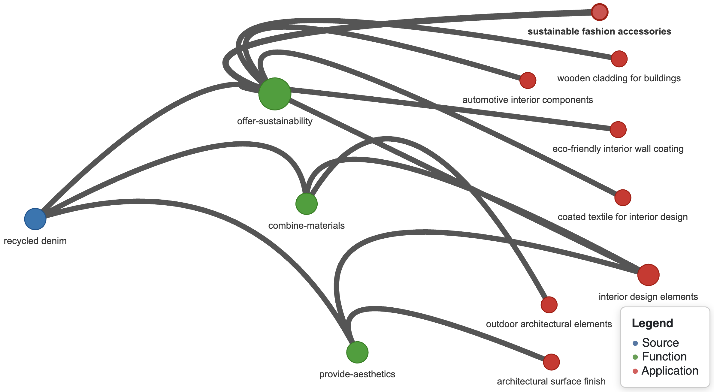

# MaterialNet: Semantic Network for Material–Function–Application Mapping

This repository contains the code, data, and example notebooks for building a semantic network of materials, their functions, and potential applications. The project is inspired by the **AskNatureNet** framework and extends its methodology into the domain of **material selection**. We use the [MaterialDistrict](https://materialdistrict.com/material/) database (3,163 materials) as the source corpus and apply **Large Language Models (LLMs)** (e.g., `gpt-4o-mini`) to extract structured knowledge triples of the form:

```

\[source, functions\[], application]

```

These triples are then transformed into a **semantic network** where nodes represent materials, functions, and applications, and edges represent either **co-occurrence** (within the same entry) or **semantic similarity** (computed with Sentence-BERT embeddings).

---

## 📂 Repository Structure

```

.
├── data
│   ├── encoding.ipynb              # Jupyter notebook for GPT-based triple encoding
│   ├── extraction.ipynb            # Jupyter notebook for scraping MaterialDistrict
│   ├── material\_urls.csv           # List of all material entry URLs
│   ├── materials\_data.csv          # Raw extracted data
│   ├── materials\_data\_encoded.csv  # Dataset after LLM-based triple encoding
│   └── materials\_data\_final.csv    # Final cleaned dataset \[source, functions, application]
├── semanticWeb
│   ├── create.ipynb                # Build semantic network from encoded triples
│   ├── mapping.ipynb               # Mapping and network expansion methods
│   ├── visualize.ipynb             # Interactive visualization with PyVis
│   ├── lib/                        # Helper functions and modules
│   ├── materials\_semantic\_network.gexf   # Exported graph (Gephi compatible)
│   ├── materials\_semantic\_network.graphml # Alternative graph format
│   ├── materials\_semantic\_edges.csv      # Edge list (with types and weights)
│   ├── materials\_semantic\_nodes.csv      # Node metadata (labels, categories)
│   └── materials\_cooccurrence\_query.html # Example interactive subgraph visualization
├── outputNetworkExample.png        # Example screenshot of the semantic network
├── requirements.txt                # Python dependencies
├── LICENSE
└── README.md                       # This file

````

---

## 🚀 Getting Started

### 1. Clone the repository
```bash
git clone https://github.com/your-username/MaterialNet.git
cd MaterialNet
````

### 2. Create a Python 3.13.6 environment

It’s recommended to use a virtual environment:

```bash
# Using venv
python3.13 -m venv venv
source venv/bin/activate   # On Linux/Mac
# On Windows: venv\Scripts\activate
```

### 3. Install dependencies

```bash
pip install -r requirements.txt
```

### 4. Run the notebooks

The repository includes several Jupyter notebooks:

* **`data/extraction.ipynb`** → scrape the MaterialDistrict database.
* **`data/encoding.ipynb`** → use GPT models to extract `[source, functions, application]` triples.
* **`semanticWeb/create.ipynb`** → construct semantic networks from triples.
* **`semanticWeb/mapping.ipynb`** → implement semantic similarity–based mapping.
* **`semanticWeb/visualize.ipynb`** → explore networks interactively with PyVis.

You can launch Jupyter with:

```bash
jupyter notebook
```

---

## 📊 Example Output

Below is a sample visualization of a semantic network generated from the `materials_data_final.csv` dataset:



---

## 📑 References

This work builds on prior research in design thinking, bio-inspired design, computational creativity, and materials informatics:

* Yilmaz, S., & Daly, S.R. (2016). *Feedback in concept development: Comparing design disciplines.* Design Studies, 45, 137–158.
* Childs, P., Han, J., Chen, L., Jiang, P., Wang, P., & Yin, Y. (2022). *The creativity diamond—A framework to aid creativity.* Journal of Intelligence, 10(4), 73.
* Helms, M., Vattam, S.S., & Goel, A.K. (2009). *Biologically inspired design: process and products.* Design Studies, 30(5), 606–622.
* Vincent, J.F., Bogatyreva, O.A., Bogatyrev, N.R., Bowyer, A., & Pahl, A.K. (2006). *Biomimetics: its practice and theory.* Journal of the Royal Society Interface, 3(9), 471–482.
* Deldin, J.M., & Schuknecht, M. (2013). *The AskNature database: enabling solutions in biomimetic design.* In *Biologically Inspired Design: Computational Methods and Tools* (pp. 17–27). Springer.
* Goel, A.K., McAdams, D.A., & Stone, R.B. (2015). *Biologically Inspired Design.* Springer.
* LeCun, Y., Bengio, Y., & Hinton, G. (2015). *Deep learning.* Nature, 521(7553), 436–444.
* Vaswani, N., Shazeer, N., Parmar, N., Uszkoreit, J., Jones, L., Gomez, A.N., & Polosukhin, I. (2017). *Attention is all you need.* Advances in Neural Information Processing Systems, 30.
* Grandi, J.M., et al. (2024). *Evaluating Large Language Models for Materials Science Applications.* (Journal reference).
* Tao, Q., et al. (2025). *Transforming Machine Learning Insights into Interpretable Design Rules for Materials Science.* (Journal of Mechanical Design).
* Bayerlein, B., et al. (2024). *Semantic web technologies in materials science.* Advanced Intelligent Systems.
* MaterialDistrict. (2025). *MaterialDistrict database.* Retrieved from [https://materialdistrict.com/material/](https://materialdistrict.com/material/)
